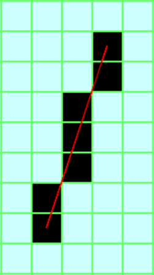

# rust_bresenham

## Usage with iterator

    use rust_bresenham::Bresenham;

    let points_iter = Bresenham::new(Point(1, 1), Point(3, 7));

    for point in points_iter {
      // (1, 2)
      // (2, 3)
      // (2, 4)
      // (2, 5)
      // (3, 6)
    }

## Get all points

    use rust_bresenham::Bresenham;

    let points = Bresenham::new(Point(3, 7), Point(1, 1)).collect();

    println!("points = {:?}", points);
    // points = [(1, 2), (2, 3), (2, 4), (2, 5), (3, 6)]
